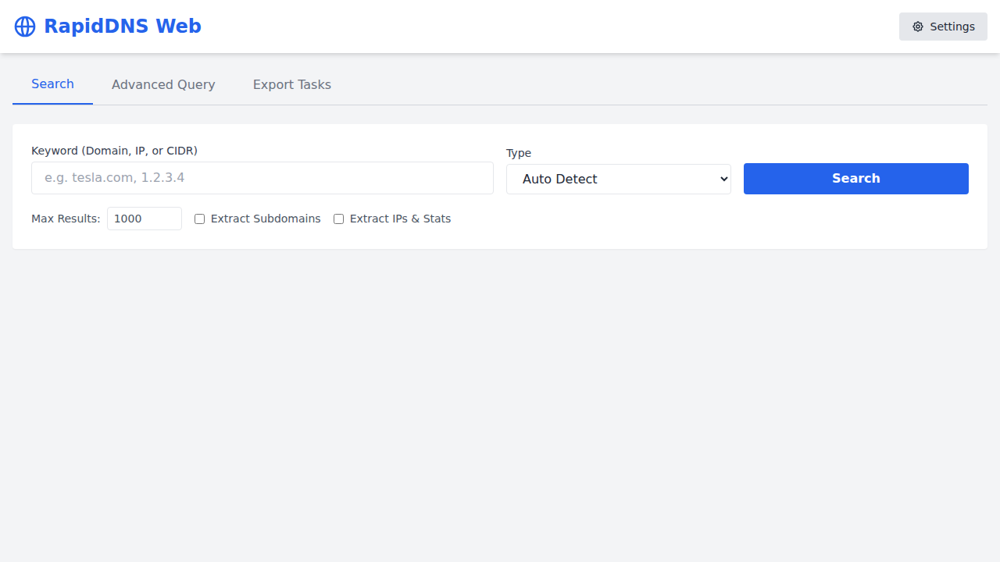

# RapidDNS Web

A powerful, browser-based interface for interacting with the [RapidDNS API](https://rapiddns.io/help/api). This tool allows you to perform DNS searches, advanced queries, and large-scale data exports directly from your browser, **without requiring a local server**.

## Features

*   **DNS Search**: Search by domain, IP, or CIDR.
*   **Advanced Query**: Use powerful query syntax (e.g., `domain:example.com AND type:A`).
*   **Data Export**: Automatically manage export tasks: start, check status, and download.
*   **Data Extraction**:
    *   Extract and deduplicate **Subdomains** to a list.
    *   Extract and deduplicate **IPs** to a list.
    *   Generate **IP Segment Statistics** (subnet counts).
*   **Flexible Output**: Save results in JSON, CSV, or Text formats.
*   **Zero Install**: Just open `index.html`.

## Getting Started

1.  **Clone or Download** this repository.
2.  **Open `index.html`** in your web browser.
3.  **Configure API Key**:
    - Click **Settings** in the top right.
    - Enter your API Key (Get one at [RapidDNS Profile](https://rapiddns.io/user/profile)).
4.  **Configure Connection Mode**:
    - **CORS Proxy (Default)**: Uses a public proxy (like `corsproxy.io`) to bypass browser security restrictions when calling the API.
    - **Direct**: Connects directly to `rapiddns.io`. *Note: This requires you to disable web security in your browser or use an extension like "Allow CORS".*

## Usage

### Search
- Enter a domain (e.g., `tesla.com`) or IP.
- Select a record type if needed.
- Click **Search**.
- Check "Extract Subdomains" or "Extract IPs" to automatically process the results into clean lists at the bottom of the page.

### Advanced Query
- Switch to the "Advanced Query" tab.
- Enter a query like `domain:apple.com AND type:A`.

### Export Tasks
- Switch to the "Export Tasks" tab for large datasets.
- Start a task and copy the Task ID.
- Check the status using the Task ID to get your download link.

## Security Note
Your API Key is stored locally in your browser's `localStorage` and is never sent anywhere except to the RapidDNS API (and the CORS proxy if enabled).

## License
MIT
